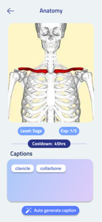

# Lingua Eidetic

 
  
A visual-text spaced-repetition learning app built on Flutter that enables users to learn more quickly

## Features

- Authentication with Google, Facebook, and email using firebase
- Data, learning progress is all sync to cloud
- Data persists both offline and online
- Levelling/Cooldown system for spaced repitition learning
- Share, download collections through a community system
- Powerful collections searching using ElasticSearch
- Image captioning for quick word generation from users photos

  
## Screenshots

  